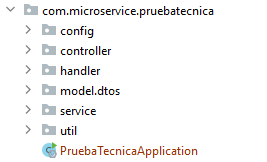

## Tabla de contenidos

1. Objetivo.
2. Proyecto y estructura.
3. Documentación expuesta a través del Swagger.
4. Sistema Integrado Unplash.
5. Lógica del servicio
6. Gestión de errores
7. Testing
8. Imagen docker


## 1. Objetivo
    Consiste en una aplicación SpringBoot y Java11 que permite exponer un servicio para filtrar datos de una colección
## 2. Proyecto y estructura

Un proyecto spring se puede crear desde la página web [Spring Initializr](https://start.spring.io/) , pudiendo configurar el nombre,la descripción, estrctura de carpetas y dependencias que necesita.

Para crear una aplicación de este tipo lo primero es crear la estructura de carpetas que sean lo más identificativas posibles sobre los tipos de ficheros que van a contener y funcionalidades que van a realizar.

La estructura de carpetas es:


## 2. Documentación expuesta a través del Swagger.

La aplicación ofrece una herramienta visual para poder probar el servicio expuesto.
Para ello es necesario añadir en el fichero pom.xml lo siguiente:
```xml
<dependency>
<groupId>org.springdoc</groupId>
<artifactId>springdoc-openapi-ui</artifactId>
<version>${springdoc.openapi}</version>
</dependency>
```
Esto nos permitirá hacer uso de las diferentes caracteristicas para generar la herramienta visual, pudiendo añadir descripciones, ejemplos, etc.
Ahora para poder confirurarlo creamos una clase, que se ha llamado OpenApiConfig.java
```java
@Configuration public class OpenApiConfig {
  /**
  * Spring OpenApi bean
  * <p>
  * Configuration to expose swagger
  * Title, description
  *
  * @return the open api
  */
  @Bean public OpenAPI springShopOpenAPI () {
  return new OpenAPI().info(
  new Info().title("Prueba tecnica API").description("Servicios expuestos del microservicio prueba tecnica")
  .version("v0.0.1").license(new License().name("Apache 2.0").url("http://springdoc.org")));
  }
}
```
Además se ha creado una url personalizada para acceder, se encuentra definida en los archivos applicattion.yml`
```yaml
springdoc:
  swagger-ui:
    path: "/prueba-tecnica/swagger-ui.html"
```

La url para acceder es: http://localhost:8080/prueba-tecnica/swagger-ui.html lo que nos mostrará


*   Primero pulsar en "/collections/all" y después en "try out"


*   Segundo añadir los filtros que se quieren probar, también se puede dejar vacío y pulsar ejecutar:


Para poder documentar la herramienta visual se puede ver en las clase CollectionFilterController.java, anotaciones como @Operation, @APiResponse, @Parameter

## 4. Sistema Integrado Unplash.

El Api externa de la que se recuperan los datos iniciales es https://api.unsplash.com/collections, para acceder a esa url se necesita tener autorización, para ello desde la propioa web de UNPLASH, se ha generado una aplicación de demo, que nos provee de esa autorización.
Esa api contiene paginación, es decir en la llamada solo se devuelven 10 datos por defecto, si hay más, es necesario realzar la misma llamada, indicandole, la siguiente página. Por ejemplo https://api.unsplash.com/collections?page=8
Para saber si existe paginación, la llamada devuelve en su cabecera un campo "Link", de la siguiente manera Link: <https://api.unsplash.com/collections?page=8>; rel="last", <https://api.unsplash.com/collections?page=2>; rel="next"
Como se puede ver se indica que hay 8 paginas, siendo la 8 la última y la siguiente página la 2.
En la documentación además indica que solo se permiten 50 llamadas por hora, haciendo la prueba, se han obtenido 146 páginas, por tanto se ha configurado que las llamadas, en vez de traer 10 datos por página, obtengan 50.

Para llamar a dicha API, se ha configurado en un archivo de propiedades de la aplicación la URL, asi como la autorización
```yaml
unsplash:
  endPoint: "https://api.unsplash.com/collections?per_page=50"
  client-id: "9wLpcq3rw6ZAlC4BM84_mkbjWmCT57OHHJoWW2mt4xQ"
```
Se ha creado una clase específica para hacer esa llamada y obtener todos los datos, si toca paginar, es decir existen más de 50 registros.
Para crear el cliente web que va a realizar esas llamadas, se ha optado por Webclient de webflux, la configuración se encuentra en la clase SSLConfig, configurada por si la conexión se va a realizar de forma segura usando certificados o no, de momento se ha puesto inhabilitado.

Como se ha explicado antes, para obtener todos los datos, hay que extraer una cabecera Link e ir realizando llamadas según si viene indicada página "next". Para ello se ha creado una utilidad, que hace justo eso. HTTPLinkHeaderUtils, tiene un método en el que se le pasa la cabecera y la "relación" o url que se quiere obtener.

Ejemplo:
```java
HTTPLinkHeaderUtils.extractURIByRel("https://api.github.com/users/steveklabnik/gists?page=2>; rel="next", <https://api.github.com/users/steveklabnik/gists?page=3>; rel="last"", "next");
```
Así mientras exista url "next" se irá llamando al API y obteniendo datos.

## 5. Lógica servicio

Del objeto que devuelve el API de unplash solo se quieren cuatro campos id,title,description,cover_photo.id

Para no tener que estar buscando en el JSON o formatear el objeto entero a Java, se ha creado una clase llamada CollectionsDeserializer, que se encarga de automaticamente ir obteniendo del JSON esos campos y formando el objeto CollectionData.
```java
public class CollectionsDeserializer extends JsonDeserializer<CollectionData> {

    @Override public CollectionData deserialize (JsonParser jsonParser, DeserializationContext deserializationContext)
            throws IOException {
        JsonNode collectionNode = jsonParser.getCodec().readTree(jsonParser);
        CollectionData collectionData = new CollectionData();
        collectionData.setId(collectionNode.get(CollectionConstants.ID).asText());
        collectionData.setDescription(collectionNode.get(CollectionConstants.DESCRIPTION).textValue());
        collectionData.setTitle(collectionNode.get(CollectionConstants.TITLE).textValue());
        collectionData.setPhotoId(collectionNode.get(CollectionConstants.COVER_PHOTO).get(CollectionConstants.ID).textValue());
        return collectionData;
    }
}
```

El flujo lógico es el siguiente, cuando se realiza la llamada a /collections/all el servicio realiza los siguientes pasos:
1. Obtener todos los datos del API de UNPLASH
2. Realizar filtrado segun en parámetro filter de la llamada
    2.1 Obtener filtros

   Se obtiene la cadena filter y se comprueba si está vacía, si no lo está se crea un objeto(mapa), clave valor
   Imaginemos que llega el filtro así. filter=id=3,title=bla, el mapa generado puede ser así
   {"id":3}
   {"title":"bla"} 

    2.2 Filtrar en la lista por esos valores 


## 6. Gestión de Errores

Para la gestión de errores producidos por el servicio se ha creado una clase que intercepta/detecta cualquier error producido y lo formatea para que sea más identificativo de lo sucedido.
Esta es la clase GlobalErrorWebExceptionHandler , según el tipo de error detectado se devuelvé un código de estado diferente y un nivel de error.
```json
{
  "errors": [
    {
    "code": "400",
    "message": "Not_found",
    "level": "ERROR",
    "description": "No se ha encontrado el dato"
    }
  ]
}
```

## 7. Testing

Se han añadido test de las clases más relevantes de la aplicación, para poder realizarlo se han añadido en el pom.xml las siguientes dependencias
```xml
    <dependency>
        <groupId>org.springframework.boot</groupId>
        <artifactId>spring-boot-starter-test</artifactId>
        <scope>test</scope>
        <exclusions>
            <exclusion>
                <groupId>junit</groupId>
                <artifactId>junit</artifactId>
            </exclusion>
            <exclusion>
                <groupId>com.vaadin.external.google</groupId>
                <artifactId>android-json</artifactId>
            </exclusion>
            <exclusion>
                <groupId>org.junit.vintage</groupId>
                <artifactId>junit-vintage-engine</artifactId>
            </exclusion>
        </exclusions>
    </dependency>
    <dependency>
        <groupId>org.junit.jupiter</groupId>
        <artifactId>junit-jupiter-engine</artifactId>
        <scope>test</scope>
    </dependency>
    <dependency>
        <groupId>org.junit.platform</groupId>
        <artifactId>junit-platform-launcher</artifactId>
        <scope>test</scope>
    </dependency>
    <dependency>
        <groupId>junit</groupId>
        <artifactId>junit</artifactId>
        <scope>test</scope>
    </dependency>
            <!-- Test Dependencies -->
    <dependency>
        <groupId>org.mockito</groupId>
        <artifactId>mockito-core</artifactId>
        <scope>test</scope>
    </dependency>
    <dependency>
        <groupId>org.mockito</groupId>
        <artifactId>mockito-inline</artifactId>
        <scope>test</scope>
    </dependency>
    <dependency>
        <groupId>com.squareup.okhttp3</groupId>
        <artifactId>mockwebserver</artifactId>
        <version>${okhttp3.version}</version>
        <scope>test</scope>
    </dependency>
```
Se ha añadido también como dependencia en el pom.xml jacoco que te permite ver el porcentaje de la lógica que se ha cubierto por los test.


## 8. Imagen docker

Para generar una imagen docker de la aplicación, se necesita crear un fichero llamado Dockerfile.

* Un Dockerfile debe comenzar con una  instrucción FROM. La  instrucción FROM especifica la imagen principal a partir de la cual se está construyendo
**adoptopenjdk/openjdk11:alpine-jre** image contiene JDK 11.
* ARG define un argumento.  ARG JAR_FILE=target/prueba-tecnica-0.0.1-SNAPSHOT.jar' apunta al archivo jar que construimos.
* COPY ${JAR_FILE} app.jar copia el jar de la aplicación en un nuevo jar denominado app.jar.
* EXPOSE 8080: expone el puerto 8080 del contenedor. A medida que la aplicación Spring Boot se ejecuta en el puerto 8080, la estamos exponiendo.
* ENTRYPOINT ["java","-jar","/app.jar"] define el comando para ejecutar la aplicación.


